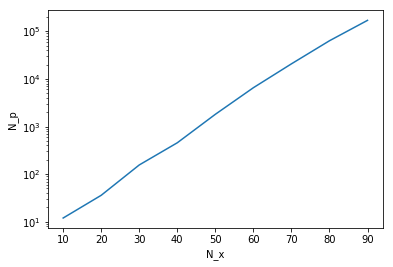
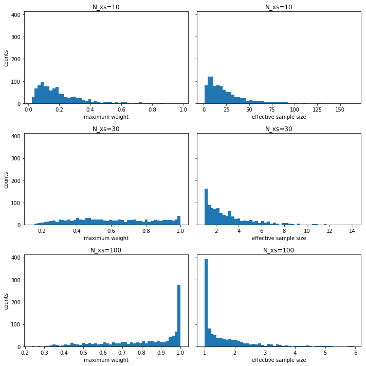




Particle filter (PF) is an ensamble Monte Carlo method to do filering problems. In contrast to Kalman filter, PF is inherently capable of solving nonlinear and nonGaussian problems. On the other hand, it struggles when the state dimenstion is high, which is a prime exmple of curse of dimensionality. Let's take a glance how and why PF fails at high dimensionality.

Suppose we have a problem $y=x+\epsilon$, where $y$ is the obervetaion corrupted by noise $\epsilon$. We want to estimate $x$. By Bayes' theorem, 
\begin{equation}
p(x|y)=\frac{p(y|x)}{\int p(y|x)p(x) dx }
\end{equation}
PF approximates the posterior as 

\begin{equation}
p(x|y) \approx \sum_i w_i \delta(x-x^{(i)}) 
\end{equation}
where the posterior weight of i-th particle is given by 
\begin{equation}
w_{i}=\frac{p(y|x^{(i)})}{\sum_{j=1}^{Np} p(y|x^{(j)})}
\end{equation}

Loosely speaking, PF is too ambitious to approximate a general high-demensional posterior distriubtion with finite number of samples, which can cause substantial errors in its posterior mean. In this sense, it also kind of explains why Kalman filter, which assumes Gaussian posterior distriubtion, is more suitable to high-dimensional problems.

In practice, weights $w_i$ are updated as the particles propgate over time and data becomes sequentially avaiable. Here we focus on the simple case $y=x+\epsilon$ where $\epsilon \sim N(0,I)$. We also generate true $x \sim N(0,I)$. Taking prior also as $x \sim N(0,I)$, Gaussian congugate pairs suggest that $x|y \sim N(\frac{y}{2}, \frac{1}{2}I$). Note that the standard normal assumptions made here are for simplicity and can be made more general. Taking the posterior mean as a point estmiate, we have the mean squared error (MSE) $E[| \frac{y}{2}-x | ^2]=\frac{N_x}{2}$. If we take the observation as a point estimate, then we have MSE $E[|y-x|^2]=N_x$. This is also the MSE if we take prior mean as the point estimate. The aforementioned MSEs are benchmarks so that any reasonble point estimates shall fall somewhere in between $N_x/2$ and $N_x$. That being said, let's examine the postior mean of PF 
\begin{equation}
\hat{x}=\sum_{i=1}^{Np} w_i x^{(i)}.
\end{equation}

We first look at how the number of particles scales up with dimensionality in order to have the MSE controlled. Then we observe a phenomenon called "weight collapse" and explore why PF fails at high dimensions. 

We start off by defining some useful functions for finding weights and MSE.


```python
from matplotlib import pyplot as plt
import numpy as np

def particle_mse(Nx,Np):
    Nsim=1000
    se=np.empty(Nsim)    
    for i in range(Nsim):
        w, xp, x = weights_from_sim(Nx,Np)
        xa=(w.reshape(Np,1)*xp).sum(axis=0)
        se[i]=((xa-x)*(xa-x)).sum()
    return np.mean(se)

def particle_maxws(Nx,Np):
    Nsim=1000
    maxws=np.empty(Nsim)
    effss=np.empty(Nsim)
    for i in range(Nsim):
        w, _ , _=weights_from_sim(Nx,Np)
        maxws[i]=w.max()
        effss[i]=1/((w*w).sum())
    return maxws, effss

def weights_from_sim(Nx,Np):
    x=np.random.normal(0, 1, [1,Nx])
    ep=np.random.normal(0, 1, [1,Nx])
    y=x+ep
    xp=np.random.normal(0, 1, [Np,Nx])
    w=np.exp(-0.5*(((xp-y)*(xp-y)).sum(axis=1)))
    return w/w.sum(), xp, x 

```

Let's ramp up state dimensions $N_x$ and see how particle number $N_p$ scales up accordingly to constrain the error below $N_x$. 


```python
Np=1
Np_last=1
incre=1
n_pts=9
Nx_ran=np.arange(10,100,n_pts)
Np_needed=np.empty(n_pts)
for i in range(n_pts):
    Nx=Nx_ran[i]
    #print(Nx)
    going_flag=True
    while(particle_mse(Nx,Np)>Nx):
        Np+=incre
        #print(Np)
        if Np>1e7:
            print('too many particles')
            break
    Np_needed[i]=Np
    incre=np.rint((Np-Np_last)/2).astype(int) #adapt incremental for speed
    Np_last=Np
```


```python
plt.semilogy(Nx_ran,Np_needed);
plt.xlabel('N_x');
plt.ylabel('N_p');
```





It turns out that the $N_p$ grows exponentially with $N_x$. In fact, it's not too hard to do asymptotic analysis to show this, using basic knowledge of central limit theorem and order statistics. We will not pursue this analysis here but refer interested readers to [this paper](https://www.stat.berkeley.edu/~bickel/Snyder%20et%20al%202008.pdf). 

Next we continue with our numerical experiment and empirically explore what can go wrong in high dimensions. The two things we take a look are maximum weights $\max_{i \in 1:N_p} w_i$ and effective sample size $(\sum_i w_i^2)^{-1}$. We plot their histograms of 1000 simulations. 


```python
fig, axs = plt.subplots(3, 2, sharey=True, tight_layout=True,figsize=(10, 10))
Np=1000
Nxs=[10, 30, 100]
for i in range(3):
    maxws, effsss = particle_maxws(Nxs[i],Np)
    axs[i,0].hist(maxws, bins=50)
    axs[i,0].set_xlabel('maximum weight')
    axs[i,0].set_ylabel('counts')
    axs[i,0].set_title('N_xs=' + str(Nxs[i]))
    axs[i,1].hist(effsss, bins=50)
    axs[i,1].set_xlabel('effective sample size')
    axs[i,1].set_title('N_xs=' + str(Nxs[i]))
```





As shown in the figures, as dimensions gets higher, weights collapse to 1, i.e., one particle with weight close to 1 and all other particles with weights close to zero.  This is called weight collapse or degeneration or impoverishment in the literature, and is common difficulty in applying PF. In a low-dimensional problem, resampling every few time steps can mitigate this issue but in high dimensions, weight collapse may be too drastic for any kinds of resampling. We also see that effective sample size shrinks substantially.  To explain effective sample size, we need another post. For now, we can simply understand it as a benchmark for errors.  
