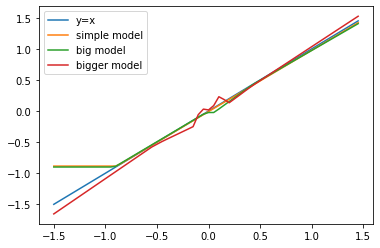



Artificial neural networks (ANN) are known to be a universal function approximator (see [Universal approximation theorem](https://en.wikipedia.org/wiki/Universal_approximation_theorem) and [a excellent visual explanation](https://http://neuralnetworksanddeeplearning.com/chap4.html)). This nice theory, however, does not tell us about the learnability of the parameters. In practice, it is more a kind of art to get ANN to work. To gain some feelings about how ANN works in practice, let’s apply it to a regression problem on some simplest data we can think of, e.g., data generated from a linear model $$y=\beta_1 x+ \beta_0 + \epsilon, \epsilon \sim N(0,\sigma^2).$$ A copy of the jupyter notebook can be found [here](https://gist.github.com/juhang62/bf7b1acd7bea8cdcca5447c10e9e9233)


```
try:
  # %tensorflow_version only exists in Colab.
  %tensorflow_version 2.x
except Exception:
  pass    
import tensorflow as tf
from tensorflow import keras
from tensorflow.keras import layers
print(tf.__version__)
```

    TensorFlow 2.x selected.
    2.1.0


```
!pip install git+https://github.com/tensorflow/docs
import tensorflow_docs as tfdocs
import tensorflow_docs.plots
import tensorflow_docs.modeling
import numpy as np
import matplotlib.pyplot as plt
```


```
tf.random.set_seed(23)
np.random.seed(23)
m=100
sigma=0.1
X=np.random.uniform(-1,1,size=(m,1))
Y=X+np.random.randn(m,1) * sigma
```

We consider a simple model with one hidden layer with one unit and a big(ger) model with 2 hidden layers with several units. 


```
def build_model(seed=None, activation='relu'):
  ini=tf.keras.initializers.he_uniform(seed=seed)
  model = keras.Sequential([
    layers.Dense(1, activation=activation, input_shape=[1], kernel_initializer=ini),
    layers.Dense(1)
  ])

  optimizer = tf.keras.optimizers.RMSprop(0.001)

  model.compile(loss='mse',
                optimizer=optimizer,
                metrics=['mae', 'mse'])
  return model


def build_model_big(seed=None,hidden_units=2):
  ini=tf.keras.initializers.he_uniform(seed=seed)
  model = keras.Sequential([
    layers.Dense(hidden_units, activation='relu', input_shape=[1], kernel_initializer=ini),
    layers.Dense(hidden_units, activation='relu'),
    layers.Dense(1)
  ])

  optimizer = tf.keras.optimizers.RMSprop(0.001)

  model.compile(loss='mse',
                optimizer=optimizer,
                metrics=['mae', 'mse'])
  return model
```


```
tf.random.set_seed(23)
model = build_model(seed=None)
model.summary()
```

    Model: "sequential"
    _________________________________________________________________
    Layer (type)                 Output Shape              Param #   
    =================================================================
    dense (Dense)                (None, 1)                 2         
    _________________________________________________________________
    dense_1 (Dense)              (None, 1)                 2         
    =================================================================
    Total params: 4
    Trainable params: 4
    Non-trainable params: 0
    _________________________________________________________________


Note that in the simple ANN model there are four parameters. But we just need two to specify a line so that the parameters are not identifiable. In general, we don’t try to interpret the parameters of ANN in contrast to linear regression so being not identifiable is less a concern. What we care most about is its prediction performance. In practice, the performance needs to be checked with testing data. Since we work with synthetic data here, we simply know that the best we can expect is to have mean squared error (MSE) equal to $\sigma^2$. Moreover, training MSE below $\sigma^2$ is a sign of overfitting. That being said, let's start our training.


```
EPOCHS = 1000
history = model.fit(
  X, Y,
  epochs=EPOCHS, verbose=0,
  callbacks=[tfdocs.modeling.EpochDots()])
```

    
    Epoch: 0, loss:0.5480,  mae:0.6256,  mse:0.5480,  
    ....................................................................................................
    Epoch: 100, loss:0.3483,  mae:0.5069,  mse:0.3483,  
    ....................................................................................................
    Epoch: 200, loss:0.3484,  mae:0.5068,  mse:0.3484,  
    ....................................................................................................
    Epoch: 300, loss:0.3484,  mae:0.5068,  mse:0.3484,  
    ....................................................................................................
    Epoch: 400, loss:0.3483,  mae:0.5068,  mse:0.3483,  
    ....................................................................................................
    Epoch: 500, loss:0.3484,  mae:0.5069,  mse:0.3484,  
    ....................................................................................................
    Epoch: 600, loss:0.3484,  mae:0.5072,  mse:0.3484,  
    ....................................................................................................
    Epoch: 700, loss:0.3484,  mae:0.5071,  mse:0.3484,  
    ....................................................................................................
    Epoch: 800, loss:0.3483,  mae:0.5069,  mse:0.3483,  
    ....................................................................................................
    Epoch: 900, loss:0.3483,  mae:0.5069,  mse:0.3483,  
    ....................................................................................................

It turns out this run got stuck into a local minimum. Let's try another run with a different random seed. (Note that there are several resources of randomness involved. The way of how the random seeds were set here is not thoroughly tested for reproducibility. In case you cannot reproduce the results here, it’s very likely you will get the gradient descent stuck at local minimum by simply trying out a few different random seeds.) 


```
tf.random.set_seed(23)
model2=build_model(2)
history = model2.fit(
  X, Y,
  epochs=EPOCHS, verbose=0,
  callbacks=[tfdocs.modeling.EpochDots()])
```

    
    Epoch: 0, loss:0.4608,  mae:0.5785,  mse:0.4608,  
    ....................................................................................................
    Epoch: 100, loss:0.2766,  mae:0.4519,  mse:0.2766,  
    ....................................................................................................
    Epoch: 200, loss:0.0875,  mae:0.2200,  mse:0.0875,  
    ....................................................................................................
    Epoch: 300, loss:0.0333,  mae:0.1464,  mse:0.0333,  
    ....................................................................................................
    Epoch: 400, loss:0.0214,  mae:0.1213,  mse:0.0214,  
    ....................................................................................................
    Epoch: 500, loss:0.0129,  mae:0.0939,  mse:0.0129,  
    ....................................................................................................
    Epoch: 600, loss:0.0117,  mae:0.0895,  mse:0.0117,  
    ....................................................................................................
    Epoch: 700, loss:0.0115,  mae:0.0888,  mse:0.0115,  
    ....................................................................................................
    Epoch: 800, loss:0.0114,  mae:0.0881,  mse:0.0114,  
    ....................................................................................................
    Epoch: 900, loss:0.0114,  mae:0.0881,  mse:0.0114,  
    ....................................................................................................

Ok, much better. The MSE got very close to $\sigma^2$ which is 0.01 in our case. Next let's check how it works on bigger models.  We start with 2 hidden layers with 2 units per layer. 


```
model_big=build_model_big(seed=None,hidden_units=2)
history = model_big.fit(
  X, Y,
  epochs=EPOCHS, verbose=0,
  callbacks=[tfdocs.modeling.EpochDots()])
```

    
    Epoch: 0, loss:1.4260,  mae:0.9264,  mse:1.4260,  
    ....................................................................................................
    Epoch: 100, loss:0.2270,  mae:0.3943,  mse:0.2270,  
    ....................................................................................................
    Epoch: 200, loss:0.0594,  mae:0.1799,  mse:0.0594,  
    ....................................................................................................
    Epoch: 300, loss:0.0217,  mae:0.1195,  mse:0.0217,  
    ....................................................................................................
    Epoch: 400, loss:0.0139,  mae:0.0970,  mse:0.0139,  
    ....................................................................................................
    Epoch: 500, loss:0.0121,  mae:0.0898,  mse:0.0121,  
    ....................................................................................................
    Epoch: 600, loss:0.0117,  mae:0.0888,  mse:0.0117,  
    ....................................................................................................
    Epoch: 700, loss:0.0117,  mae:0.0890,  mse:0.0117,  
    ....................................................................................................
    Epoch: 800, loss:0.0115,  mae:0.0878,  mse:0.0115,  
    ....................................................................................................
    Epoch: 900, loss:0.0114,  mae:0.0874,  mse:0.0114,  
    ....................................................................................................

I didn't specify the seed for initilizing parameters. You can run it serveral times to be sure that the MSE constistently reachest 0.01. Next, we take a look of a bigger ANN with 64 units per layer.


```
model_bigger=build_model_big(None,64)
history = model_bigger.fit(
  X, Y,
  epochs=EPOCHS, verbose=0,
  callbacks=[tfdocs.modeling.EpochDots()])
```

    
    Epoch: 0, loss:0.2401,  mae:0.3350,  mse:0.2401,  
    ....................................................................................................
    Epoch: 100, loss:0.0135,  mae:0.0991,  mse:0.0135,  
    ....................................................................................................
    Epoch: 200, loss:0.0129,  mae:0.0935,  mse:0.0129,  
    ....................................................................................................
    Epoch: 300, loss:0.0148,  mae:0.1022,  mse:0.0148,  
    ....................................................................................................
    Epoch: 400, loss:0.0109,  mae:0.0849,  mse:0.0109,  
    ....................................................................................................
    Epoch: 500, loss:0.0105,  mae:0.0838,  mse:0.0105,  
    ....................................................................................................
    Epoch: 600, loss:0.0098,  mae:0.0802,  mse:0.0098,  
    ....................................................................................................
    Epoch: 700, loss:0.0128,  mae:0.0940,  mse:0.0128,  
    ....................................................................................................
    Epoch: 800, loss:0.0099,  mae:0.0824,  mse:0.0099,  
    ....................................................................................................
    Epoch: 900, loss:0.0092,  mae:0.0781,  mse:0.0092,  
    ....................................................................................................

It turned out that MSE got below 0.01 indicating that the bigger models tend to overfit the data. 

Let's plot all the fitted models on a range [-1.5 1.5]. Since data is in the range [-1,1], we will see how the models extrapolate.  

 


```
Xtest=np.arange(-1.5,1.5,0.05)
Xtest=Xtest.reshape((len(Xtest),1))
l1,l2,l3,l4 =plt.plot(Xtest,Xtest, Xtest, model2.predict(Xtest), Xtest, model_big.predict(Xtest), \
         Xtest, model_bigger.predict(Xtest))
l1.set_label('y=x')
l2.set_label('simple model')
l3.set_label('big model')
l4.set_label('bigger model')
_=plt.legend()
```



Interestingly the simple model does not extrapolate well on the lower end. Since the simple model used here has only 4 parameters. We can take a look under the hood by printing out the parameters (a.k.a weights) of the fitted simple model. 


```
weights = model2.get_weights()
print(weights)
print(weights[0]*weights[2])
print(weights[1]*weights[2]+weights[3])
```

    [array([[1.2940449]], dtype=float32), array([1.1512104], dtype=float32), array([[0.76187253]], dtype=float32), array([-0.8852261], dtype=float32)]
    [[0.98589724]]
    [[-0.00815046]]


The last two outputs are close to the true $\beta_1=1, \beta_0=0$. This 1-layer-1-unit ANN with RELU activation simply scales the input into the activated part of RELU and then scales it back. Thus, in effect, it is fitting a linear model using gradient descent. 
What if we use other activation function, say tanh? we can do the training in our head based on what we just learned from RELU: suppose we scale the input close to 0 taking advantage of the fact that tanh has derivative 1 at 0, then scale it back just as in the case of RELU. That is, we just need zero biases, a tiny weight at input and its inverse as the weight at ouput.     


```
model_tanh=build_model(activation='tanh')
myweights=[np.ones((1,1))*1e-4,np.zeros((1,)),np.ones((1,1))*1e4,np.zeros((1,))]
model_tanh.set_weights(myweights) 
loss, mae, mse = model_tanh.evaluate(X, Y, verbose=2)
```

    100/100 - 0s - loss: 0.0112 - mae: 0.0848 - mse: 0.0112


MSE is close to 0.01 with this preset weights. So we know our mental training worked. But it should be noted that this set of parameters is not learnable. (we can see from the below output that the gradient descent is extremely unstable with the above initial parameters.) It is less of a suprise if we look at the [backprop formulas](https://raw.githubusercontent.com/Kulbear/deep-learning-coursera/997fdb2e2db67acd45d29ae418212463a54be06d/Neural%20Networks%20and%20Deep%20Learning/images/grad_summary.png). 


```
history = model_tanh.fit(
  X, Y,
  epochs=EPOCHS, verbose=0,
  callbacks=[tfdocs.modeling.EpochDots()])
```

    
    Epoch: 0, loss:409.2284,  mae:9.8839,  mse:409.2284,  
    ....................................................................................................
    Epoch: 100, loss:54.6464,  mae:6.2411,  mse:54.6464,  
    ....................................................................................................
    Epoch: 200, loss:32.9344,  mae:5.2882,  mse:32.9343,  
    ....................................................................................................
    Epoch: 300, loss:11.4532,  mae:2.8242,  mse:11.4532,  
    ....................................................................................................
    Epoch: 400, loss:35.7270,  mae:4.8484,  mse:35.7270,  
    ....................................................................................................
    Epoch: 500, loss:16.4805,  mae:3.7299,  mse:16.4805,  
    ....................................................................................................
    Epoch: 600, loss:4.7298,  mae:2.0895,  mse:4.7298,  
    ....................................................................................................
    Epoch: 700, loss:33.6568,  mae:4.0052,  mse:33.6568,  
    ....................................................................................................
    Epoch: 800, loss:45.2253,  mae:5.3791,  mse:45.2253,  
    ....................................................................................................
    Epoch: 900, loss:8.6634,  mae:2.6273,  mse:8.6634,  
    ....................................................................................................

## Conclusion
Our experiment on ANN applied to linear data revealed its stochastic nature and tendency to overfit. Even with this simple data, the ANN cannot be expected to work out of box, and getting it to work involves some level of tweeking. We learned that having several runs with random initializing weights can reduce the chance of stucking at bad local minima. It can be expected that in a real application, tweaking the model to get desirable performance can require quite a lot of work. 
